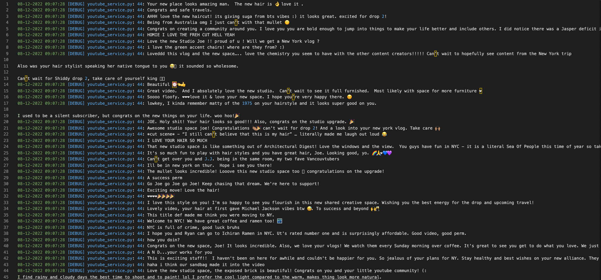

## Sentiment Analysis on YouTube comments

Author: Zixuan Ge, zge7@


## Overview


* Above image is an example output from executing the program.

Have you ever wondered what the public thought when your favorite YouTuber posted a new video on YouTube? This is important because YouTube removed the public dislike count back in November 2021. I have built this problem through a command-line interface for users to interact and retrieve the result of the sentiment analysis on the YouTube video comments using contents covered including performing sentiment analysis, cranfield evaluation methodology etc. in CS410 Text Information System at UIUC. 


## Team member contributions

Zixuan Ge, 100% on coding, documentation & demo video and code walkthrough


## Used libraries

I have included the list of used libraries below:

YouTube Data API V3: [https://developers.google.com/youtube/v3](https://developers.google.com/youtube/v3)

Google Cloud: [https://console.cloud.google.com/](https://console.cloud.google.com/)

NLTK: [https://www.nltk.org/_modules/nltk/sentiment/vader.html](https://www.nltk.org/_modules/nltk/sentiment/vader.html)

Pandas: [https://pandas.pydata.org/](https://pandas.pydata.org/)

Matplotlib: [https://matplotlib.org/](https://matplotlib.org/)


## Code Structure

The code structure of the application is relatively straightforward. It consists of 4 main parts as follows:

`comment_analysis.py` contains the main class of the application, which handles user inputs to the terminal GUI interface, and calls to other classes to create a `YoutubeService` class, perform sentiment analysis and create a pie chart as the output of the program.

`youtube_service.py` is responsible for communicating with YouTube APIs to retrieve comments from a YouTube video. The video id is extracted from the URL, and a convenience method for retrieving the video title is provided. 

In the main method `get_comment_threads`, we retrieve all the comments for the YouTube video, including replies to comments if specified by the user in the params. Please note that max comments we could retrieve at a time is 100, so we would need to perform several retrievals to get all the comments and this could be **extremely** heavy-load and **costly **in terms of API usages if the video has hundreds of thousands comments. 




* Above image shows extracted raw comments from a YouTube video

`sentiment_analyzer.py` handles several things stated below:


1. It creates a Panda dataframe storing all the raw comments.
2. Performs data cleaning to remove white spaces, new lines, special characters and common stopwords.
3. Performs sentiment analysis on the cleaned data by computing the polarity score and classifying the score into 3 categories “Positive”, “Negative” and “Neutral” using the NLTK library.


* Above image shows the polarity score for each comment and the sentiment classification

`pie_chart.py` creates a resulting pie chart using Matplotlib, showcasing the percentage of each category specified above.


## Instructions


### How to install?

Follow the instructions [here](https://cloud.google.com/appengine/docs/standard/nodejs/building-app/creating-project) to create a new project on [Google Cloud console](console.cloud.google.com) (*****Make sure** to link a billing account to your project, otherwise the API will not work properly.***) Once the project is created, select API & Services on the side menu and enable “YouTube Data API V3”.

Next, select Credentials on the side menu and create an API key, store the key in `youtube_service.py` in the `__init__` function below:


```
self._service = build("youtube", "v3", developerKey="YOUR_API_KEY")
```


Next, make sure you install the following packages with python3.5 and above using `pip install`


```
python3 -m pip install google-api-python-client nltk pandas matplotlib
```


### How to use the software?

There are 3 ways the program can be used in the command-line terminal interface:


1. User could use the -d option `python3 comment_analysis.py -d with the default config file, and modify the url in config.json:`

```
{
   "url": "https://www.youtube.com/watch?v=5luGt0W9iyM",
   "include_replies": 0,
   "output_file": "sentiment_analysis_chart.png"
}
```


2. User could provide their own config file with --cf option: `python3 comment_analysis.py -cf custom.json`
3. User could manual provide all of the parameters using the following command:

```
python3 comment_analysis.py --url https://www.youtube.com/watch?v=Lp2TwoaW_Hw --include_replies 1 --output sentiment_analysis_chart 
```


### Example use case

Below is an example command the user could use, once they followed the installation instructions above. A pie chart named “sentiment_analysis_chart” will be created capturing the percentage of each sentiment category, an example image has been shown at the top of this document above.


```
python3 comment_analysis.py --url https://www.youtube.com/watch?v=5luGt0W9iyM --output sentiment_analysis_chart
```